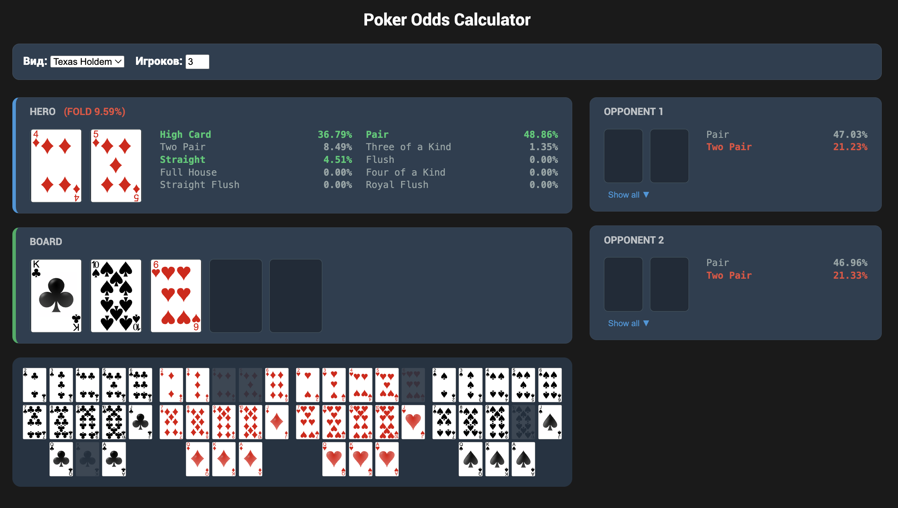

# Poker Odds Calculator (Monte Carlo Engine)

Профессиональный движок для расчета вероятностей в покере (Texas Hold'em), работающий на основе статистического моделирования. Система анализирует текущую руку игрока, карты на столе и карты оппонентов, выдавая точный прогноз на победу (Equity) и детализированные вероятности по каждой комбинации.

## 🧠 Математическая модель

В основе калькулятора лежит **метод Монте-Карло**. В покере количество возможных комбинаций оставшихся карт может исчисляться миллиардами, что делает прямой перебор (брутфорс) невозможным для веб-инструмента реального времени.

### Как производятся вычисления:
1.  **Исключение известных карт**: Из стандартной колоды (52 карты) извлекаются карты игрока (Hero), общие карты (Board) и карты оппонентов.
2.  **Многократная симуляция**: Движок проводит **100,000 итераций** случайных раздач.
    * Достраивает Board до 5 карт из остатка колоды.
    * Если руки оппонентов неизвестны, им сдаются случайные карты из остатка колоды (из-за этого вероятность может "гулять" в небольших пределах при одинаковых вводных).
3.  **Статистический анализ**: Equity (шанс на победу) рассчитывается как отношение выигранных симуляций к общему количеству итераций:
    $$Equity = \frac{Wins}{Total Iterations} \times 100\%$$
4.  **Точность**: При 100,000 итераций статистическая погрешность составляет менее **±0.1%**, что позволяет видеть даже минимальные риски (например, шанс на флеш у оппонента в 4.5% на терне).

## 🛠 Техническая реализация

Движок реализован на языке **PHP** и работает в формате JSON-API.

### Основные компоненты:
* **Hand Evaluator**: Функция `evaluateHand` присваивает каждой руке уникальный числовой рейтинг (Score).
    * *Royal Flush*: `9,000,000`.
    * *Straight Flush*: `8,000,000 + старшая карта`.
    * Это позволяет мгновенно сравнивать силу рук без сложных вложенных условий.
* **Card Parser**: Автоматически распознает ранг и масть карты, извлекая данные из имен файлов изображений.
* **Dynamic Deck**: Система учитывает "мертвые карты", исключая их из генерации случайных исходов.

## 🚀 Запуск и использование

### Требования:
* PHP 7.4+
* Любой веб-сервер (Nginx, Apache) или локальная среда (XAMPP).

### Установка:
1.  Разместите файлы проекта в корневой директории сервера.
2.  Убедитесь, что изображения карт находятся по пути `Deck/`.
3.  Откройте `index.php` в браузере.

### Принцип работы интерфейса:
* **Hero Hand**: Выберите две карты для расчета ваших шансов.
* **Board**: Добавляйте карты стола, чтобы видеть, как меняется вероятность в реальном времени.
* **Equity Labels**: Система автоматически подсвечивает лучшее действие (Raise/Call/Fold) на основе математического ожидания.

---
*Разработано для образовательных целей и анализа покерных стратегий.*